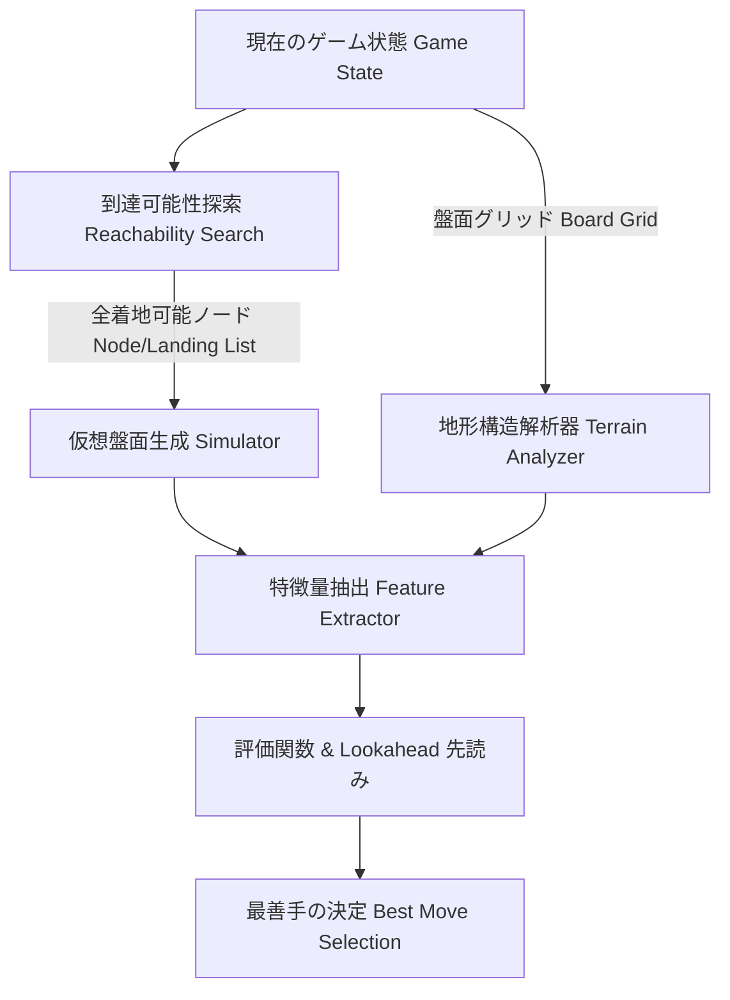

# テトリスAI 地形探索アルゴリズム 設計書 (PLAN.md)

## 1. 概要と目的 (Overview & Objectives)

現在の `tetris_ai` におけるミノの配置探索 (`enumerate_moves_for_piece`) は、出現位置 (Y=2) での単純な左右水平移動＋垂直ハードドロップのみを検証しています。この方式には以下の致命的な限界が存在します：

1. **T-Spin や回転入れ (Spin-in) の探索不可**: SRS (Super Rotation System) のウォールキックを利用した穴やスロットへの回転滑り込みが探索できません。
2. **オーバーハング（屋根）下の滑り込み (Tuck / Slide) の探索不可**: 横穴や屋根の下にミノを滑り込ませる手を見逃します。
3. **盤面地形 (Terrain Profile) の評価不足**: 単純な高さ・穴の数だけでなく、アクセシビリティ（アクセス可能か）、パリティ（偶奇バランス）、T-Spin構造の保持・作成評価が不十分です。

本設計書では、**全到達可能状態の動的グラフ探索 (BFS/Reachability Search)** と **高度な盤面地形解析 (Terrain Surface Analysis)** を統合した「地形探索アルゴリズム」の仕様を定義します。

---

## 2. アーキテクチャとコンポーネント構成 (Architecture)



地形探索アルゴリズムは大きく2つのコアモジュールで構成されます：

1. **Reachability Search Engine（到達可能着地探索エンジン）**
   - SRS回転法則・横移動・ソフトドロップを再現し、発生位置から操作可能かつ着地固定できる全 `(x, y, rotation)` 候補手と操作経路を完全網羅探索します。
2. **Terrain & Topology Analyzer（地形構造分析モジュール）**
   - 盤面の凹凸構造、隠れ穴、屋根（オーバーハング）、T-Spinスロット、上部からのアクセス可能性（Flood-Fill）、パリティバランスを計算し、AI評価の特徴量として出力します。

---

## 3. 到達可能性探索アルゴリズム (Reachability Search Algorithm)

### 3.1 状態定義とグラフ遷移

- **状態 (State)**: `State { x: i32, y: i32, rotation: u8 }`
- **移動操作 (Move Actions)**:
  1. `MoveLeft`: `(x - 1, y, rot)`
  2. `MoveRight`: `(x + 1, y, rot)`
  3. `SoftDrop`: `(x, y + 1, rot)`
  4. `RotateCW`: 時計回り回転＋SRSウォールキックオフセット試行
  5. `RotateCCW`: 反時計回り回転＋SRSウォールキックオフセット試行
  6. `Rotate180`: 180度回転 (オプション)

### 3.2 到達可能着地探索のアルゴリズムフロー (BFS)

```rust
// 擬似コード構造
pub struct ReachableLanding {
    pub piece: Piece,
    pub path: Vec<MoveAction>,
    pub is_tspin: bool,
}

pub fn search_reachable_landings(game: &Game, block_type: BlockType) -> Vec<ReachableLanding> {
    let mut landings = Vec::new();
    let mut visited = [[[false; 4]; BOARD_WIDTH]; INTERNAL_HEIGHT];
    let mut queue = VecDeque::new();

    let start_piece = Piece::new(block_type);
    if !game.is_valid_position(&start_piece) {
        return landings; // 発生位置で衝突している場合は探索不能
    }

    queue.push_back((start_piece, Vec::new()));
    visited[start_piece.y as usize][start_piece.x as usize][start_piece.rotation] = true;

    while let Some((curr, path)) = queue.pop_front() {
        // 現在位置が着地状態（下に落とせない状態）かを判定
        if is_landing_position(game, &curr) {
            landings.push(ReachableLanding {
                piece: curr.clone(),
                path: path.clone(),
                is_tspin: check_tspin(game, &curr),
            });
        }

        // 次の遷移可能状態を探索
        for action in MoveAction::all() {
            if let Some(next_piece) = try_apply_action(game, &curr, action) {
                let (nx, ny, nrot) = (next_piece.x as usize, next_piece.y as usize, next_piece.rotation);
                if !visited[ny][nx][nrot] {
                    visited[ny][nx][nrot] = true;
                    let mut next_path = path.clone();
                    next_path.push(action);
                    queue.push_back((next_piece, next_path));
                }
            }
        }
    }

    landings
}
```

---

## 4. 地形構造解析アルゴリズム (Terrain Topology Analysis)

盤面の地形状態を詳細に分析し、特徴量ベクトルとして抽出します。

```
【地形分析のコンセプト図】
 Column Heights & Contour      Overhang / Roof & Cave          T-Spin Slot Detection
    [ ]           [ ]             [■][■][■]  ← 屋根               [■][ ]  [■]
    [■]    [■]    [■]             [■][ ]     ← 滑り込み用空間      [■][ ][ ][■]  ← Corner check
    [■][■] [■][■] [■]             [■][■][■]  ← 床                 [■][■][ ][■]
    列標高・Bumpiness算出          穴・被せブロック・アクセシビリティ    T-Spin Double/Triple検出
```

### 4.1 主な地形解析指標

1. **輪郭・標高・Bumpiness (Contour & Height Profile)**
   - 各列の高さ $H_x$ と隣接列との差分 $\sum |H_x - H_{x+1}|$。
   - 谷 (Wells) の深さと位置（テトリス棒用の1列谷か、危険な複数列谷か）。

2. **穴 (Holes) と閉塞度 (Covered Index)**
   - **完全空洞穴 (Buried Holes)**: 上部にブロックが存在する空きセル。
   - **被せブロック数 (Blocks Above Holes)**: 穴を掘り起こすために消去が必要な上のブロックの総数。
   - **深層穴ペナルティ**: 盤面下部（Y座標が大きい位置）にある穴ほど指数関数的に高ペナルティ。

3. **屋根・オーバーハング (Overhangs)**
   - $Y$ 行目の空マスの上部（$Y-1$ 行目など）にブロックが存在する構造。
   - 滑り込み探索（BFS）と組み合わせることで、「解決可能なオーバーハング」か「詰まりを引き起こす破壊的オーバーハング」かを識別。

4. **上部アクセス可能性 (Sky Accessibility / Flood-fill)**
   - 最上部バッファ (Y=0) から 4方向/8方向にフラッドフィル（塗りつぶし）を行い、外部からアクセス可能な空きセルとアクセス不能な密閉領域を判定。

5. **T-Spin スロット検出 (T-Spin Slot Detection)**
   - Tミノの3コーナー条件 (3-Corner Test) に合致する $3 \times 3$ 構造の探索。
   - TSD (T-Spin Double), TST (T-Spin Triple), TSS (T-Spin Single) の枠組が盤面上に存在するか、またはあと1手で完成するかをインスペクション。

6. **パリティバランス (Checkerboard Parity Balance)**
   - 盤面を市松模様 (Black/White) に色分けし、各色の空きマス数の差分を計算。
   - Sミノ・Zミノを平坦に置くにはパリティバランスの維持が不可欠であるため、偏りをペナルティ化。

---

## 5. 高速化技術 (Performance Optimization)

リアルタイム評価（1手あたり数ミリ秒以内）を達成するための実装最適化手法：

1. **GPUアクセラレーション (wgpu Compute Shader によるバッチ並列評価)**
   - `wgpu` (WebGPU) を用いて単体/統合GPU上の Compute Shader で大規模候補手バッチ評価を並列計算。
   - **優先度1**: 独立GPU (`PowerPreference::HighPerformance` - NVIDIA / AMD Radeon RX シリーズ等)
   - **優先度2**: 内蔵グラフィック (`PowerPreference::LowPower` - Intel UHD/Iris, AMD Radeon Vega/iGPU等)
   - **フォールバック**: GPU非搭載環境またはエラー時は自動的に CPU (Rayon マルチスレッド) に切り替え。
2. **GPU駆動マルチターン先読み (GPU Beam Search Lookahead)**
   - `md_dir/algorithm.md` のビーム探索仕様に基づき、先読み深さ（最大5手先）の全シミュレーションブランチで発生する数百〜数千の候補手状態を1つの巨大バッチとしてGPU Compute Shaderに投入し、超高速並列評価を実施。
3. **探索空間の枝刈り (Visited State Pruning)**
   - `visited[y][x][rot]` の3次元配列により、重複判定・同一状態の再探索を完全に排除。

---

## 6. 実装フェーズとロードマップ (Implementation Roadmap)

| フェーズ | 内容 | 成果物・対象ファイル |
|---|---|---|
| **Phase 1** | SRS対応の BFS 到達可能性探索エンジンの実装 | `src/ai.rs`, `src/tetris.rs` |
| **Phase 2** | 地形構造解析モジュール (`TerrainAnalyzer`) の作成 | `src/ai.rs` (新構造体) |
| **Phase 3** | 特徴量抽出のアップデートと評価関数の再チューニング | `src/config.rs`, `src/ai.rs` |
| **Phase 4** | Lookahead 先読みへの到達探索統合と動作検証 | `src/main.rs`, `src/ai.rs` |

---

## 7. まとめ

本アルゴリズムの導入により、従来の「上からの垂直ドロップ」に制限されていたAIから、**「T-Spin・屋根下滑り込み・回転入れを自在に駆使し、複雑な地形を打開できる高度なテトリスAI」** へと進化させることができます。
